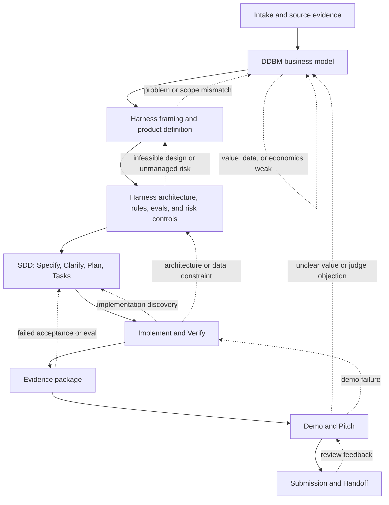
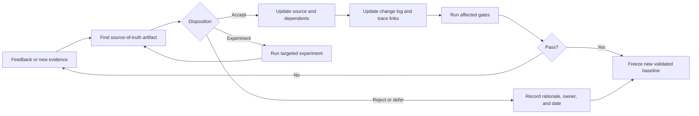

# End-to-End Delivery Workflow

This document explains how DDBM, Harness Engineering, Spec-Driven Development (SDD), evidence, demo, and pitch work together. The workflow is sequential enough to create dependable artifacts, but iterative enough to absorb what the team learns during business review, implementation, testing, and judging preparation.

## 한국어 요약

이 워크플로는 세 방법을 결합한다.

- **DDBM**은 데이터, 고객 가치, 비용, 수익, 부정적 영향을 포함해 사업 모델을 설계한다.
- **Harness Engineering**은 제품 맥락, 용어, 도메인, 명세, 아키텍처, AI 행동 규칙, 평가, 리스크 통제를 연결한다.
- **SDD**는 합의된 명세를 작업 단위, 코드, 테스트, 작동하는 MVP로 변환한다.

진행 방향은 `Idea -> DDBM -> Harness -> SDD -> Evidence -> Demo/Pitch -> Handoff`이다. 하지만 일방통행은 아니다. 개발 중 데이터 확보가 불가능하다는 사실을 발견하면 BM과 데이터 전략으로 돌아가고, 테스트가 실패하면 기능 명세나 구현으로 돌아간다. 피치 준비 중 가치 제안이 약하면 BM과 CPS를 다시 다듬는다. 모든 변경은 원본 문서에 반영하고 `docs/11_change-log.md`에 기록한 다음 영향받은 검증을 다시 통과해야 한다.

## The Combined System

```text
Idea and source material
          |
          v
DDBM business model
          |
          v
Harness product and control system
          |
          v
SDD implementation
          |
          v
Evidence and validation
          |
          v
Demo and pitch
          |
          v
Submission and handoff

At any stage:
finding -> source artifact -> dependent artifacts -> revalidation
```



Dashed arrows are controlled feedback paths. They do not authorize silent rewrites: each loop must update the source of truth, record the decision, and rerun affected gates.

## Lifecycle Stages

### 0. Intake And Source Preservation

**Question:** What do we actually know, and where did it come from?

Capture competition rules, judging criteria, interviews, meeting notes, datasets, API documents, existing code, assumptions, and open questions before synthesis.

**Primary artifacts**

- `docs/00_source-log.md`
- `docs/01_meeting-log.md`
- Existing research, code, and submission materials

**Exit gate**

- Important claims have a source or are marked as assumptions.
- Competition requirements and deadlines are traceable.
- Missing information is visible rather than invented.

### 1. DDBM Business Model

**Question:** Why should this product exist as a data-driven business?

Define the 11 DDBM blocks: Mission, Key Partners, Key Activities, Key Data, Key Enablers, Key Barriers, Value Proposition, Benefits, Negative Impacts, Costs, and Revenues. Separate the user, beneficiary, buyer, and payer when they are not the same actor.

**Primary artifacts**

- `docs/01_business-model.md`
- Business metrics and unit-economics assumptions
- Data strategy and partner assumptions
- Risk IDs originating from Negative Impacts

**Exit gate**

- The customer, problem, value, data advantage, and revenue logic form one coherent model.
- Data access, quality, permission, freshness, and cost are addressed.
- Costs and revenues contain measurable assumptions.
- Negative impacts are linked to reviewable risks.

### 2. Harness Framing And Product Definition

**Question:** What exactly are we building, for whom, and within which boundaries?

Convert business intent into a shared product model. Define Context-Problem-Solution, principles, vocabulary, actors, entities, states, permissions, product surfaces, PRD scope, and feature acceptance criteria.

**Primary artifacts**

- `docs/02_cps.md`
- `docs/03_principles.md`
- `docs/04_definitions.md`
- `docs/05_domain-model.md`
- `docs/06_prd.md`
- `docs/08_feature-spec.md`

**Exit gate**

- Every MVP feature traces to a defined problem and business value.
- Actors, entities, states, events, permissions, and failure states are explicit.
- Acceptance criteria are observable and testable.
- Out-of-scope items are recorded.

### 3. Harness Architecture, Controls, And Evaluation

**Question:** How will the product operate safely and how will success be judged?

Define components, dataflow, integration boundaries, AI judgment-action-verification loops, deterministic coding rules, evaluation cases, approvals, auditability, privacy, security, and fail-closed behavior.

**Primary artifacts**

- `docs/07_architecture.md`
- `docs/09_flow.md`
- `docs/10_eval-plan.md`
- `rules/*.md`
- `evals/rubric.md`
- `evals/golden-cases.md`
- `evals/failure-modes.md`

**Exit gate**

- Architecture supports the feature specification without hidden dependencies.
- High-risk actions have evidence, approval, audit, and failure controls.
- Golden cases and failure modes can distinguish acceptable from unacceptable behavior.
- Implementation rules are specific enough for different coding agents to converge.

### 4. SDD Implementation

**Question:** How do we turn the approved specification into working software?

SDD means Spec-Driven Development in this workflow. It consumes Harness artifacts rather than replacing them.

```text
Specify -> Clarify -> Plan -> Tasks -> Implement -> Verify
```

- **Specify:** Select a feature and freeze its observable behavior and acceptance criteria.
- **Clarify:** Resolve ambiguity, assumptions, edge cases, and external dependencies.
- **Plan:** Choose components, interfaces, data migrations, controls, and tests.
- **Tasks:** Break the plan into small, reviewable, verifiable units.
- **Implement:** Change code and supporting artifacts together.
- **Verify:** Run tests, evals, security checks, and acceptance scenarios.

**Primary artifacts**

- Feature-level implementation specification
- Implementation plan and task checklist
- Code, tests, migrations, and configuration
- Updated `docs/11_change-log.md`

**Exit gate**

- The implementation satisfies acceptance criteria and relevant Harness rules.
- Tests cover expected behavior and named failure modes.
- Deviations discovered during coding are reflected in source documents.
- The feature can run in the intended demo environment.

The current plugin provides the Harness inputs for SDD. Dedicated SDD command automation is a roadmap item; teams can still follow this sequence directly using the generated feature specifications and rules.

### 5. Evidence And Validation

**Question:** What proves that the business and product claims are true enough?

Collect evidence instead of treating implementation completion as proof. Evidence may include external research, user validation, prototype logs, test output, latency and cost measurements, eval scores, approval logs, and screenshots or recordings of the working scenario.

**Primary artifacts**

- Validation report
- Test and eval results
- Business metric evidence
- Risk-control evidence
- Claim-to-evidence matrix

**Exit gate**

- Each major pitch claim has an evidence level and source.
- Demonstrated features have reproducible results.
- Known failures and limitations are disclosed.
- Required project and pack validators pass.

### 6. Demo And Pitch

**Question:** Can judges understand the value and see credible proof within the allotted time?

Build the narrative from verified artifacts: problem, differentiated insight, data advantage, solution, working scenario, evidence, business model, risk control, execution plan, and ask. The demo proves behavior; the pitch explains why that behavior matters.

**Primary artifacts**

- `docs/12_handoff.md`
- Demo script and recovery path
- Pitch outline or deck
- Judge Q&A and objection responses
- Submission checklist

**Exit gate**

- Every important slide traces to a source, product artifact, or evidence item.
- The demo has a tested happy path, failure path, and fallback.
- Answers to likely objections do not exceed the evidence.
- Submission format and judging criteria are covered.

### 7. Submission And Handoff

**Question:** Can another person reproduce, operate, evaluate, and continue the work?

Freeze the submitted version, document how to run it, preserve decisions and known risks, and separate demonstrated capabilities from future plans.

**Primary artifacts**

- Final `README.md`
- `docs/11_change-log.md`
- `docs/12_handoff.md`
- Tagged release or submission snapshot

**Exit gate**

- Setup and demo commands are reproducible.
- Secrets and private data are excluded.
- Known limitations and owners are recorded.
- Submission artifacts match the tested version.

## Feedback Loops

Feedback is expected. The important distinction is whether feedback produces a traceable update or an undocumented patch.

| Feedback discovered in | Typical finding | Return to | Then propagate to |
|---|---|---|---|
| DDBM review | Weak payer motive, inaccessible data, poor unit economics | `docs/01_business-model.md` | CPS, PRD, metrics, pitch |
| Product definition | Wrong actor, unclear scope, missing state or permission | CPS/domain model/PRD | Architecture, feature specs, rules |
| Architecture and risk review | Infeasible integration, privacy issue, missing approval | Architecture/risk source | Feature specs, tasks, evals, demo |
| Development | API or data constraint, excessive cost, impossible acceptance criterion | Relevant business or Harness source | Plan, tasks, tests, pitch claims |
| Evaluation | Golden-case failure, unsafe action, weak quality metric | Feature spec, rules, or implementation | Code, evals, evidence package |
| Demo rehearsal | Slow path, brittle setup, confusing user flow | Implementation or product flow | Demo script, evidence, handoff |
| Pitch review | Value unclear, unsupported claim, judge objection | DDBM, CPS, or evidence source | Pitch, Q&A, demo emphasis |
| Submission review | Format or judging criterion missing | Required source artifact | Checklist and final package |

## Change Propagation Protocol

Use this loop whenever feedback changes a decision, requirement, or claim:

1. **Capture the finding.** Record the reviewer, date, evidence, and affected claim or requirement.
2. **Identify the source of truth.** Update the earliest authoritative artifact, not only the slide, code, or demo script where the issue appeared.
3. **Assess impact.** Find dependent business, product, architecture, code, eval, risk, demo, and pitch artifacts.
4. **Choose the disposition.** Accept, reject with rationale, defer with an owner and date, or run an experiment.
5. **Update and link.** Use stable IDs for requirements, features, risks, eval cases, and pitch claims where practical.
6. **Record the change.** Add the decision and affected files to `docs/11_change-log.md`.
7. **Rerun affected gates.** Repeat only the necessary review, implementation, validation, and rehearsal steps.
8. **Freeze a new baseline.** The latest validated artifacts become the next source for development and presentation.



## Traceability Chain

A strong project keeps the following chain visible:

```text
Source
  -> Business assumption
  -> Problem and value proposition
  -> Requirement and feature
  -> Architecture and rule
  -> Implementation task and code
  -> Test or eval result
  -> Demo step
  -> Pitch claim
```

When one link changes, review the links to its right. When evidence contradicts an earlier assumption, move left and repair the source model before continuing.

## Practical Operating Cadence

For a competition or MVP, use short review cycles rather than completing every document once and treating it as final.

```text
Cycle 1: Business viability
  DDBM -> CPS -> evidence check

Cycle 2: Product viability
  Domain -> PRD -> feature spec -> architecture review

Cycle 3: Technical viability
  SDD plan -> thin implementation -> tests and evals

Cycle 4: Judge viability
  Evidence -> demo rehearsal -> pitch review -> Q&A

Cycle 5: Release readiness
  Validation -> submission checklist -> handoff -> freeze
```

Use `/harness-engineering:route` when the next missing artifact is unclear. Use `/harness-engineering:validate-harness` before implementation, submission, demo, handoff, or release.
